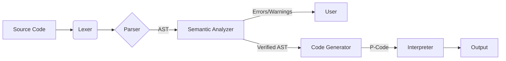

## 📖 项目简介 (Introduction)
本项目是 **PL/0 语言** 的完整编译系统实现。它采用了经典的编译原理架构，将源代码编译为基于栈的 **P-Code**（伪代码），并提供了一个配套的栈式虚拟机来执行生成的代码。

该项目不仅仅实现了基础功能，还引入了现代编译器的高级特性，如**恐慌模式错误恢复**、**Levenshtein 拼写建议**以及**编译期常量折叠**，旨在展示对编译原理底层机制（如分程序结构、活动记录、静态链）的深度理解。

## ✨ 核心特性 (Key Features)

### 1. 前端技术 (Frontend)
*   **词法分析 (Lexer):**
    *   基于 **DFA**（确定性有限自动机）实现。
    *   支持双字符运算符预读（Lookahead），如 `<=`, `>=`。
*   **语法分析 (Parser):**
    *   采用 **递归下降分析法 (Recursive Descent Parsing)**。
    *   实现了 **恐慌模式 (Panic Mode)** 错误恢复机制，单次编译可报告多个错误，不会因首个错误而中断。
    *   构建完整的 **抽象语法树 (AST)**，而非简单的直接翻译。

### 2. 语义分析与优化 (Semantic Analysis & Optimization)
*   **作用域管理:** 基于符号表栈（Symbol Table Stack）处理嵌套过程定义。
*   **智能拼写建议:** 引入 **Levenshtein 编辑距离算法**。当使用未定义变量时，自动推荐最接近的变量名（如 `countr` -> `counter`）。
*   **静态计算:**
    *   **常量折叠:** 编译期计算常量表达式（如 `2 + 3` -> `5`）。
    *   **安全检测:** 编译期拦截除零错误、检测死循环（`while 1=1`）及不可达代码（`if 0=1`）。

### 3. 后端技术 (Backend)
*   **代码生成:**
    *   基于 AST 后序遍历生成 P-Code。
    *   使用 **地址回填 (Backpatching)** 技术处理控制流跳转（If/While）。
*   **虚拟机 (Interpreter):**
    *   模拟基于栈的计算机架构。
    *   完整实现 **活动记录 (Activation Record)**，包含 **静态链 (Static Link)**、动态链和返回地址，完美支持多层过程嵌套和非局部变量访问。

## 📂 项目结构 (Directory Structure)

```text
PL0-Compiler/
├── src/
│   ├── token.py              # Token 定义与枚举
│   ├── lexer.py              # 词法分析器
│   ├── ast_nodes.py          # AST 节点类定义
│   ├── parser.py             # 语法分析器 (AST构建 + 错误恢复)
│   ├── symbol_table.py       # 符号表与 Levenshtein 算法
│   ├── semantic_analyzer.py  # 语义分析与静态检查
│   ├── instructions.py       # P-Code 指令集定义
│   ├── codegen.py            # 代码生成器 (AST -> P-Code)
│   └── interpreter.py        # P-Code 解释器 (虚拟机)
├── tests/                    # 测试用例目录
│   ├── valid_gcd.pl0         # GCD 算法测试
│   ├── error_test.pl0        # 错误恢复测试
│   └── nested_scope.pl0      # 嵌套作用域测试
├── main.py                   # 程序主入口
└── README.md                 # 项目说明文档
```

## 🚀 快速开始 (Quick Start)

### 环境要求
*   Python 3.10 或更高版本

### 安装

```bash
git clone https://github.com/your-username/pl0-compiler.git
cd pl0-compiler
```

### 运行程序
你可以通过命令行运行编译器，指定 PL/0 源文件路径：

```bash
# 运行示例：计算最大公约数
python main.py tests/valid_gcd.pl0
```

如果代码包含错误，编译器将输出带有行号的错误信息及修复建议：

```bash
python main.py tests/error_test.pl0
# 输出示例: [Semantic Error] Line 5: 未定义的标识符 'countr'. 您是不是想输入 'counter'?
```

## 📝 PL/0 语法示例
以下是一段支持嵌套过程和递归的 PL/0 代码示例（求最大公约数）：

```pascal
program gcdExample;
var x, y, z;

procedure gcd;
var f, g;
begin
    f := x;
    g := y;
    while f <> g do
    begin
        if f < g then g := g - f;
        if g < f then f := f - g
    end;
    z := f
end;

begin
    x := 84;
    y := 36;
    call gcd;
    write(z)  (* Output should be 12 *)
end.
```

## 🛠️ 技术原理 (Technical Implementation)

### 1. 编译流程



### 2. 运行时栈帧 (Runtime Stack Frame)
虚拟机通过维护 `STACK` 数组模拟内存，每个过程调用分配一个栈帧：

| Offset | 名称 | 描述 |
| :--- | :--- | :--- |
| **0** | **SL** (Static Link) | 静态链，指向**定义层**的基址（解决嵌套变量访问）。 |
| **1** | **DL** (Dynamic Link) | 动态链，指向**调用者**的基址。 |
| **2** | **RA** (Return Address)| 返回地址。 |
| **3+** | Locals & Args | 局部变量与参数。 |
